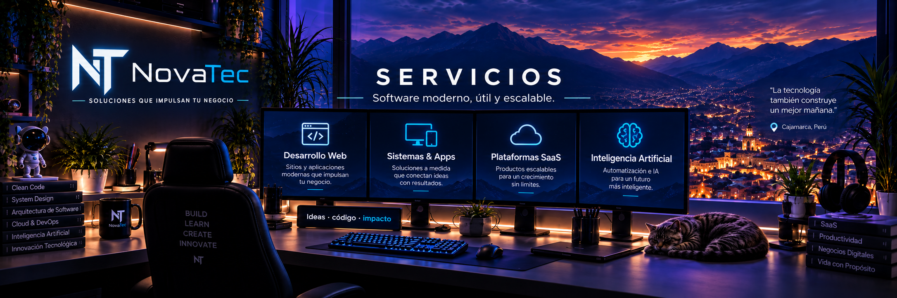
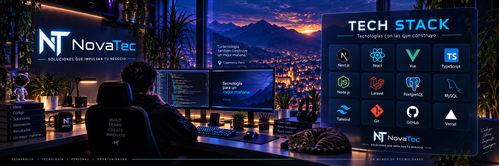
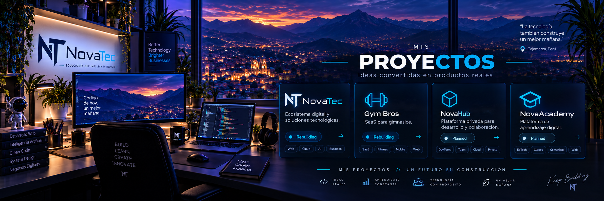

  <!-- BANNER PRINCIPAL -->
  

    

  <!-- QUICK CHIPS -->
  
  
  
  

 

---

## 👤 Sobre Mí

👋 **Hola, soy Luis Carranza.** Desarrollador **Full Stack** especializado en la intersección de **ingeniería de software e Inteligencia Artificial**, y fundador de **NovaTec**.

Diseño y construyo soluciones digitales modernas, robustas y escalables: desde arquitecturas web fluidas y sistemas de gestión avanzados hasta plataformas SaaS multi-tenant y automatizaciones inteligentes aplicadas a procesos de negocio.

Mi enfoque une **código limpio**, **arquitectura sólida** y una **estética visual de primer nivel**, orientada siempre a generar impacto y valor real.

> 📍 **Ubicación:** Cajamarca, Perú · *Construyendo hoy un futuro más inteligente.*

 

---

## 🚀 Lo que hago

  

 

<table>
  <tr>
    <td width="50%" valign="top">
      <h3>🌐 Desarrollo Web & Sistemas</h3>
      
Creación de sitios web modernos, sistemas de gestión internos y paneles administrativos eficientes, responsivos y con experiencia de usuario fluida.

    </td>
    <td width="50%" valign="top">
      <h3>⚡ Plataformas SaaS</h3>
      
Diseño y desarrollo de plataformas basadas en suscripción, multi-tenant, con autenticación segura, control de permisos y arquitectura para escalar.

    </td>
  </tr>
  <tr>
    <td width="50%" valign="top">
      <h3>🔌 APIs & Backend Robusto</h3>
      
Arquitectura de servicios RESTful, integración con bases de datos relacionales y diseño de capas backend optimizadas para alta disponibilidad.

    </td>
    <td width="50%" valign="top">
      <h3>🧠 Software with AI</h3>
      
Automatizaciones avanzadas, integración de modelos de lenguaje (LLMs) y herramientas con inteligencia artificial diseñadas para optimizar operaciones.

    </td>
  </tr>
</table>

 

---

## ⚡ Tech Stack

  

 

  

    

  <!-- Categorías limpias -->
  <table>
    <tr>
      <td align="right"><b>Frontend</b></td>
      <td>Next.js · React · Vue.js · TypeScript · Tailwind CSS</td>
    </tr>
    <tr>
      <td align="right"><b>Backend</b></td>
      <td>Node.js · Laravel · Express · RESTful APIs</td>
    </tr>
    <tr>
      <td align="right"><b>Bases de Datos</b></td>
      <td>PostgreSQL · MySQL</td>
    </tr>
    <tr>
      <td align="right"><b>Ecosistema & Cloud</b></td>
      <td>Git · GitHub · Vercel · CI/CD</td>
    </tr>
  </table>

 

---

## 📂 Proyectos Principales

  

 

| Proyecto | Descripción | Enfoque | Estado |
| :--- | :--- | :--- | :---: |
| **🚀 NovaTec** | Ecosistema digital integral y desarrollo de soluciones de software de alto impacto. | `Web` `Cloud` `AI` `Business` |  |
| **🏋️ Gym Bros** | Plataforma SaaS especializada en gestión de miembros, control y analítica para gimnasios. | `SaaS` `Fitness` `Web` `Mobile` |  |
| **📦 NovaHub** | Espacio privado y centralizado para herramientas internas de desarrollo y colaboración. | `DevTools` `Team` `Cloud` `Private` |  |
| **🎓 NovaAcademy** | Plataforma educativa de contenidos prácticos y formación en tecnología y desarrollo moderno. | `EdTech` `Cursos` `Comunidad` `Web` |  |

 

---

## 🏢 NovaTec

   

  

    

  

    <b>NovaTec</b> es mi iniciativa tecnológica orientada a transformar necesidades comerciales en software funcional, moderno y rentable. 
    Desarrollamos soluciones digitales desde cero combinando <b>tecnología de vanguardia</b>, <b>diseño de experiencia</b> y <b>automatización con IA</b>.
  

   

  <blockquote>
    <b><i>“Soluciones que impulsan tu negocio”</i></b>
  </blockquote>

   

  <!-- Conexión -->
  
  

 

---

  <h3>💡 Aprender · Crear · Innovar · Impactar</h3>
  © 2026 Luis Carranza · Impulsado por <b>NovaTec</b>

