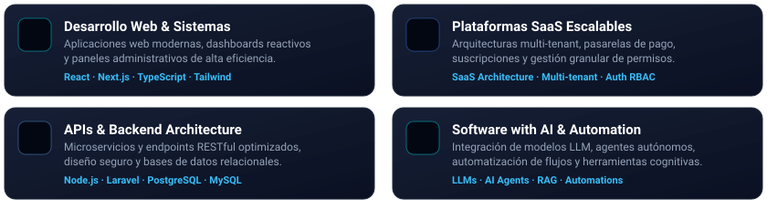

  <!-- BANNER HERO PRINCIPAL -->
  

    

  <!-- EFECTO TYPEWRITER DINÁMICO (ANIMACIÓN EN TIEMPO REAL) -->
  

   

  <!-- BADGES CHIPS CYBERTECH -->
  
  
  
  

    

  <!-- LÍNEA DIVISORA ANIMADA NEÓN -->
  

 

## 👤 Sobre Mí

👋 **Hola, soy Luis Carranza.** Desarrollador **Full Stack** especializado en la convergencia de **ingeniería de software de alta gama e Inteligencia Artificial**, y fundador de **NovaTec**.

Diseño y construyo soluciones digitales modernas, robustas y escalables: desde arquitecturas web fluidas y sistemas de gestión avanzados hasta plataformas SaaS multi-tenant y automatizaciones inteligentes orientadas a valor de negocio real.

Mi filosofía de desarrollo se basa en:
- **Arquitectura Limpia & Escalabilidad:** Código desacoplado, modular y preparado para crecer.
- **Experiencia de Usuario Premium:** Interfaces ultra fluidas, estéticas y con alto estándar visual.
- **Automatización & IA:** Flujos inteligentes que reducen fricción y maximizan la productividad.

> 📍 **Ubicación:** Cajamarca, Perú · *“Construyendo hoy un futuro más inteligente.”*

 

<!-- LÍNEA DIVISORA -->

 

## 🚀 Especialidad & Servicios

<!-- COMPONENTE VECTORIAL ANIMADO CON EFECTOS CSS GLOW Y TARJETAS DARK GLASS -->

  

 

<!-- DETALLES TÉCNICOS EN ESTRUCTURA HTML LIMPIA -->
<table>
  <tr>
    <td width="50%" valign="top">
      <h4>🌐 Desarrollo Web &amp; Sistemas</h4>
      
Creación de aplicaciones web con Next.js y React, paneles de control administrativos interactivos, dashboards de datos en tiempo real y arquitecturas Frontend orientadas a rendimiento y SEO.

    </td>
    <td width="50%" valign="top">
      <h4>⚡ Plataformas SaaS Escalables</h4>
      
Modelado de sistemas multi-tenant, integración de pasarelas de pago, autenticación robusta (OAuth/JWT), sistemas de membresías y bases de datos relacionales normalizadas.

    </td>
  </tr>
  <tr>
    <td width="50%" valign="top">
      <h4>🔌 APIs &amp; Arquitectura Backend</h4>
      
Desarrollo de microservicios y APIs RESTful con Node.js y Laravel. Enfoque prioritario en seguridad, validación de esquemas, rendimiento en queries y mantenibilidad a largo plazo.

    </td>
    <td width="50%" valign="top">
      <h4>🧠 Software with AI</h4>
      
Integración de capacidades cognitivas mediante modelos LLMs, generación aumentada por recuperación (RAG), automatizaciones complejas y agentes para optimización de flujos operativos.

    </td>
  </tr>
</table>

 

<!-- LÍNEA DIVISORA -->

 

## ⚡ Tech Stack

  

    

  <!-- TABLA HTML ESTILIZADA DE TECNOLOGÍAS -->
  <table>
    <thead>
      <tr>
        <th align="center">Capa</th>
        <th align="left">Tecnologías Principales</th>
        <th align="center">Nivel de Enfoque</th>
      </tr>
    </thead>
    <tbody>
      <tr>
        <td align="center"><b>Frontend</b></td>
        <td><code>Next.js</code> · <code>React</code> · <code>Vue.js</code> · <code>TypeScript</code> · <code>Tailwind CSS</code></td>
        <td align="center">🟢 Producción / Avanzado</td>
      </tr>
      <tr>
        <td align="center"><b>Backend</b></td>
        <td><code>Node.js</code> · <code>Laravel</code> · <code>Express</code> · <code>REST APIs</code></td>
        <td align="center">🟢 Producción / Avanzado</td>
      </tr>
      <tr>
        <td align="center"><b>Bases de Datos</b></td>
        <td><code>PostgreSQL</code> · <code>MySQL</code></td>
        <td align="center">🟢 Arquitectura & Modelado</td>
      </tr>
      <tr>
        <td align="center"><b>DevOps & Cloud</b></td>
        <td><code>Git</code> · <code>GitHub</code> · <code>Vercel</code> · <code>CI/CD Pipelines</code></td>
        <td align="center">🟢 Despliegue Continuo</td>
      </tr>
    </tbody>
  </table>

 

<!-- LÍNEA DIVISORA -->

 

## 📂 Proyectos Principales

<!-- TARJETAS VECTORIALES CON PULSO RADAR ACTIVO (CSS KEYFRAMES) -->

  

 

<!-- DESPLEGABLES INTERACTIVOS DE DETALLES TÉCNICOS (HTML INTERACTIVO EN GITHUB) -->

  
<b>🔍 Detalles de los Proyectos y Roadmap</b>

   
  <table>
    <thead>
      <tr>
        <th align="left">Proyecto</th>
        <th align="left">Descripción & Propósito</th>
        <th align="center">Ecosistema</th>
        <th align="center">Estado</th>
      </tr>
    </thead>
    <tbody>
      <tr>
        <td><b>🚀 NovaTec</b></td>
        <td>Ecosistema digital integral de servicios tecnológicos y desarrollo de software moderno.</td>
        <td><code>Next.js</code> <code>Laravel</code> <code>PostgreSQL</code></td>
        <td align="center"></td>
      </tr>
      <tr>
        <td><b>🏋️ Gym Bros</b></td>
        <td>Plataforma SaaS para la gestión, control de accesos, membresías y analítica de gimnasios.</td>
        <td><code>React</code> <code>Node.js</code> <code>Tailwind</code></td>
        <td align="center"></td>
      </tr>
      <tr>
        <td><b>📦 NovaHub</b></td>
        <td>Entorno privado de microservicios, automatización y colaboración interna para desarrollo.</td>
        <td><code>TypeScript</code> <code>Cloud</code> <code>DevTools</code></td>
        <td align="center"></td>
      </tr>
      <tr>
        <td><b>🎓 NovaAcademy</b></td>
        <td>Espacio educativo e interactivo orientado a formar desarrolladores con tecnologías modernas.</td>
        <td><code>EdTech</code> <code>Comunidad</code> <code>Web</code></td>
        <td align="center"></td>
      </tr>
    </tbody>
  </table>

 

<!-- LÍNEA DIVISORA -->

 

## 🏢 NovaTec

   

  <!-- LOGO OFICIAL NOVATEC CON GLOW NEÓN -->
  

    

  

    <b>NovaTec</b> es mi iniciativa tecnológica orientada a transformar necesidades comerciales en software funcional, moderno y rentable. 
    Desarrollamos soluciones digitales combinando <b>tecnología de vanguardia</b>, <b>diseño de experiencia</b> y <b>automatización con IA</b>.
  

   

  <blockquote>
    <b><i>“Soluciones que impulsan tu negocio”</i></b>
  </blockquote>

   

  <!-- ENLACES DE CONEXIÓN -->
  
  

 

<!-- LÍNEA DIVISORA -->

 

  <h3>💡 Aprender · Crear · Innovar · Impactar</h3>
  © 2026 Luis Carranza · Impulsado por <b>NovaTec</b>

