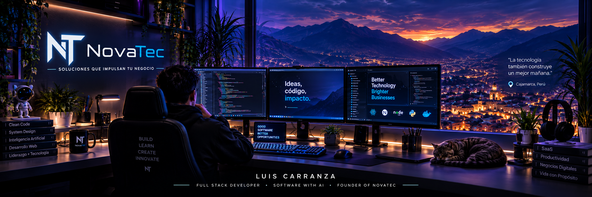

  <!-- BANNER PRINCIPAL -->
  

    

  <!-- QUICK CHIPS -->
  
  
  
  

 

## 👤 Sobre Mí

👋 **Hola, soy Luis Carranza.** Desarrollador **Full Stack** enfocado en el desarrollo de software moderno y soluciones potenciadas con **Inteligencia Artificial**, y fundador de **NovaTec**.

Diseño y construyo sistemas web escalables, plataformas SaaS de alto rendimiento y automatizaciones inteligentes orientadas a resolver problemas reales de negocio con arquitectura limpia y estética cuidada.

> 📍 *Cajamarca, Perú · Construyendo hoy un futuro más inteligente.*

 

---

## 🚀 Lo que hago

- 🌐 **Desarrollo Web & Sistemas:** Sitios web modernos, aplicaciones reactivas y paneles administrativos robustos.
- ⚡ **Plataformas SaaS:** Arquitecturas escalables multi-tenant con modelos de suscripción y control de acceso.
- 🔌 **APIs & Backend:** Servicios RESTful modulares, optimización de base de datos relacionales y alta concurrencia.
- 🧠 **Inteligencia Artificial:** Integración de LLMs, agentes inteligentes y automatización cognitiva de procesos.

 

---

## ⚡ Tech Stack

  

    

  | Categoría | Tecnologías |
  | :--- | :--- |
  | **Frontend** | Next.js · React · Vue.js · TypeScript · Tailwind CSS |
  | **Backend** | Node.js · Laravel · Express · RESTful APIs |
  | **Bases de Datos** | PostgreSQL · MySQL |
  | **Cloud & DevOps** | Git · GitHub · Vercel · CI/CD |

 

---

## 📂 Proyectos Principales

| Proyecto | Descripción | Enfoque | Estado |
| :--- | :--- | :--- | :---: |
| **🚀 NovaTec** | Ecosistema digital integral y soluciones tecnológicas a medida. | `Web` `Cloud` `AI` `Business` |  |
| **🏋️ Gym Bros** | SaaS especializado en la administración y control de gimnasios. | `SaaS` `Fitness` `Web` `Mobile` |  |
| **📦 NovaHub** | Espacio privado para herramientas internas y colaboración. | `DevTools` `Team` `Cloud` `Private` |  |
| **🎓 NovaAcademy** | Plataforma educativa interactiva para formación tecnológica. | `EdTech` `Cursos` `Comunidad` `Web` |  |

 

---

## 🏢 NovaTec

   

  

    

  <blockquote>
    <b><i>“Soluciones que impulsan tu negocio”</i></b>
  </blockquote>

  

    Iniciativa enfocada en desarrollo de software, plataformas SaaS y herramientas con IA orientadas al crecimiento empresarial.
  

   

  

 

---

  <h3>💡 Aprender · Crear · Innovar · Impactar</h3>
  © 2026 Luis Carranza · Impulsado por <b>NovaTec</b>

